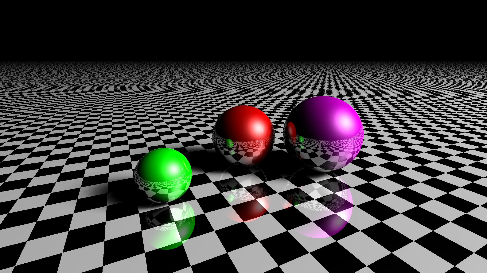

# Ray Tracer

```kotlin
Scene(
    camera = Camera(
        position = Point3F(-1f, 1f, 1f),
        lookAt = Point3F(0f, 0.3f, -1f),
        planeNormal = Point3F.yUnit(),
        width = 2560,
        height = 1440
    ),
    lights = listOf(
        LightDisc(center = Point3F(10f, 10f, 10f), radius = 5f, towards = Point3F.origin())
    ),
    objects = listOf(
        Sphere(Point3F(0.6f, 0.35f, -0.6f), 0.35f, UniformMaterial(Point3F(0.5f, 0f, 0.5f))),
        Sphere(Point3F(-0.8f, 0.2f, -0.7f), 0.2f, UniformMaterial(Point3F(0f, 0.6f, 0f))),
        Sphere(Point3F(0f, 0.3f, -1f), 0.3f, UniformMaterial(Point3F(0.5f, 0f, 0f))),
        Plane(Point3F.origin(), Point3F.yUnit(), CheckeredMaterial())
    )
).renderToFile("output/images/${System.currentTimeMillis()}.png")
```



# Build Animation

1- Execute `Video.kt`

2- Mux images (`ffmpeg` required): `make in=output/animation`

[](https://youtu.be/klVCeTXNX2M)