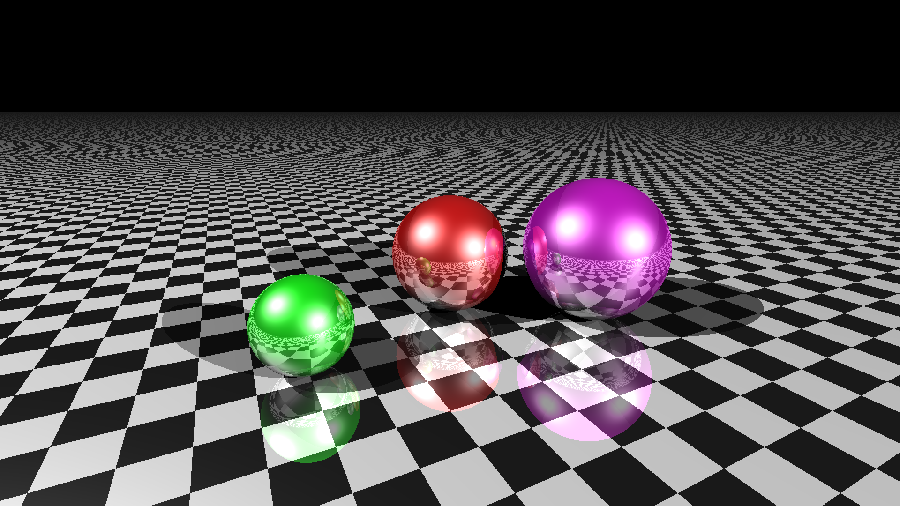

# Ray Tracer

```kotlin
Scene(
    camera = Camera(
        position = Point3F(-1f, 1f, 1f),
        lookAt = Point3F(0f, 0.3f, -1f),
        planeNormal = Point3F.yUnit(),
        width = 1920,
        height = 1080
    ),
    lights = listOf(
        Light(position = Point3F(5f, 5f, 10f)),
        Light(position = Point3F(-5f, 5f, -1.5f))
    ),
    objects = listOf(
        Sphere(Point3F(0.6f, 0.35f, -0.6f), 0.35f, UniformMaterial(Point3F(0.5f, 0f, 0.5f))),
        Sphere(Point3F(-0.8f, 0.2f, -0.7f), 0.2f, UniformMaterial(Point3F(0f, 0.6f, 0f))),
        Sphere(Point3F(0f, 0.3f, -1f), 0.3f, UniformMaterial(Point3F(0.5f, 0f, 0f))),
        Plane(Point3F.origin(), Point3F(0f, 1f, 0f), CheckeredMaterial())
    )
).renderToFile("output/images/${System.currentTimeMillis()}.png")
```

